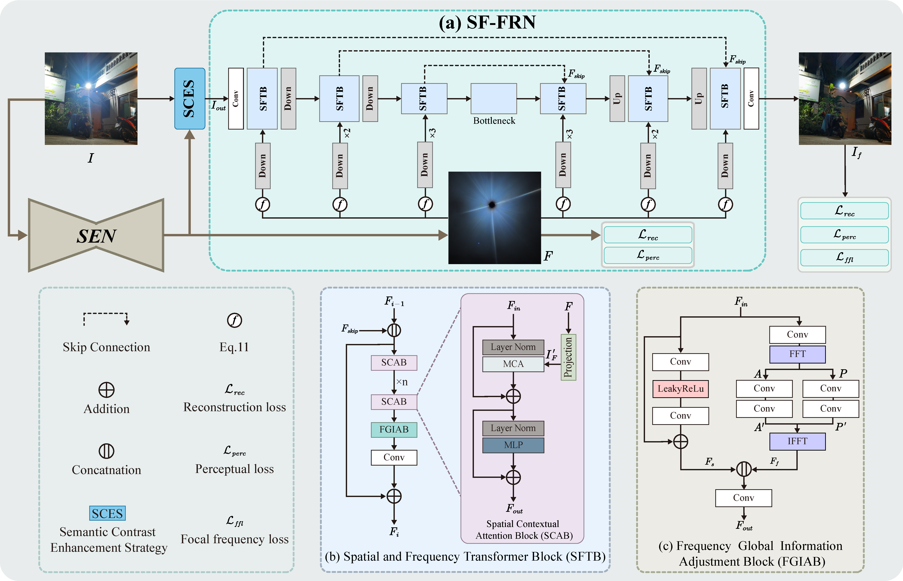

# Self-prior Guided Spatial and Fourier Transformer for Nighttime Flare Removal (SGSFT)

The codebase provides the official PyTorch implementation and some model checkpoints for the paper ["Self-prior Guided Spatial and Fourier Transformer for Nighttime Flare Removal"](https://ieeexplore.ieee.org/abstract/document/10877847) (accepted by TASE-2025).

<p align="center">
  
</p>

<details>
<summary> <b> ABSTRACT </b> </summary>
>When capturing scenes with intense light sources, extensive flare artifacts often obscure the background and degrade image quality. Most flare removal methods directly process the flare-corrupted image as the optimization target, limiting the model's understanding and generalization in complex real-world scenarios. In this paper, we propose a novel Self-prior Guided Spatial and Fourier Transformer (SGSFT) for nighttime flare removal. Specifically, we first establish a Self-prior Extraction Network to capture inherent priors in different scenes. Subsequently, we introduce a Semantic Contrast Enhancement Strategy to reinforce the semantic irrelevance between flare and light source, enabling the flare removal network to learn pattern differences between them and thus preserve light source. Finally, we build a Spatial and Frequency Flare Removal Network with Spatial Contextual Attention Block (SCAB) and  Frequency Global Information Adjustment Block (FGIAB) to generate flare-free image. SCAB can perceive rich contextual information from self-prior guided regions and infer reasonable content. FGIAB captures global luminance representation in the frequency domain to maintain luminance consistency between the inferred regions and the flare-free areas. Extensive experiments demonstrate that the proposed approach achieves optimal performance in real nighttime scenes and exhibits robust generalization across various flare scenarios captured by different electronic devices.
</details>

<p align="center">
  
</p>

## Prerequisites

- Clone the repo

  ```bash
  git clone https://github.com/cranbs/SGSFT.git
  ```

1. Install dependent packages

    ```bash
    cd basicsr
    pip install -r requirements.txt
    ```

## Datasets

### Data Download

|                        |                        Baidu Netdisk                         |                         Google Drive                         | Number | Description                                                  |
| :--------------------- | :----------------------------------------------------------: | :----------------------------------------------------------: | :----- | ------------------------------------------------------------ |
| Flare7K++(**new**)     | [link](https://pan.baidu.com/s/1iNomlQuapPdJqtg3_uX_Fg?pwd=nips) | [link](https://drive.google.com/file/d/1PPXWxn7gYvqwHX301SuWmjI7IUUtqxab/view) | 7,962  | Flare7K++ consists of Flare7K and Flare-R. Flare7K offers 5,000 scattering flare images and 2,000 reflective flare images, consisting of 25 types of scattering flares and 10 types of reflective flares. Flare-R offers 962 real-captured flare patterns. |
| Background Images      | [link](https://pan.baidu.com/s/1BYPRCNSsVmn4VvuU4y4C-Q?pwd=zoyv) | [link](https://drive.google.com/file/d/1GNFGWfUbgXfELx5fZtjTjU2qqWnEa-Lr/view) | 23,949 | The background images are sampled from [[Single Image Reflection Removal with Perceptual Losses, Zhang et al., CVPR 2018]](https://people.eecs.berkeley.edu/~cecilia77/project-pages/reflection.html). We filter our most of the flare-corrupted images and overexposed images. |
| Flare-corrupted images | [link](https://pan.baidu.com/s/1bCOOpO3FKBZvI1aezfbFOw?pwd=ears) | [link](https://drive.google.com/file/d/19kLXf8roHoJmxyphYvrCs9zDAXsrL1sU/view?usp=sharing) | 645    | We offer an extra flare-corrupted dataset without ground truth. It contains 645 images captured by different cameras and some images are very challenging. |
| Consumer Electronics   | [link](https://pan.baidu.com/s/1KPjDAvNDaLwdxBgtRGPe2A) (password: ptb3) | [link](https://drive.google.com/drive/folders/1J1fw1BggOP-L1zxF7NV0pYhvuZQsmiWY) | 100+   | Flare corrupted image captured by different consumer electronics. |

## Usage

### Checkpoint

You can download our trained models from  the [google drive](https://drive.google.com/file/d/1rq3z5U3K16Cx7IU6XtTk_UOP-0qbH-Rs/view?usp=drive_link). [夸克网盘](https://pan.quark.cn/s/781306e5761a)

### Training

The training on Flare7kpp dataset:
```
python basicsr/train.py -opt basicsr/options/TSFRNet_flare7kpp_baseline_option.yml
```

### Testing

The testing on dataset:

```
python test.py
```

### Evaluating

The evaluate on Flare7kpp dataset:

```
python evaluate.py
```

## Acknowledgement

Our code was descended and modified from the open-source code and datasets by Yuekun Dai. Thanks for their contribution to the field of flare removal! **[[Flare7kpp Project](https://github.com/ykdai/Flare7K)]**

## License

This codebase is released under the [Apache 2.0 license](LICENSE).

## Citation

If you find this repository useful, please kindly consider citing the following paper:
```
@ARTICLE{10877847,
  author={Ma, Tianlei and Kai, Zhiqiang and Miao, Xikui and Liang, Jing and Peng, Jinzhu and Wang, Yaonan and Wang, Hao and Liu, Xinhao},
  journal={IEEE Transactions on Automation Science and Engineering}, 
  title={Self-prior Guided Spatial and Fourier Transformer for Nighttime Flare Removal}, 
  year={2025},
  volume={22},
  number={},
  pages={11996-12011},
  doi={10.1109/TASE.2025.3539632}}
```
